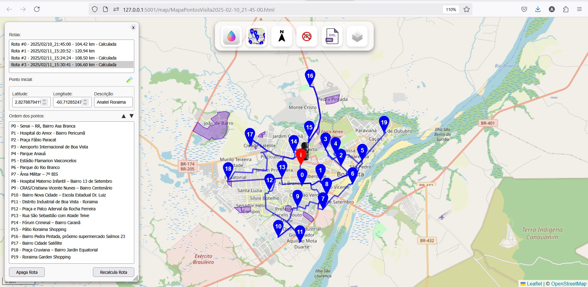
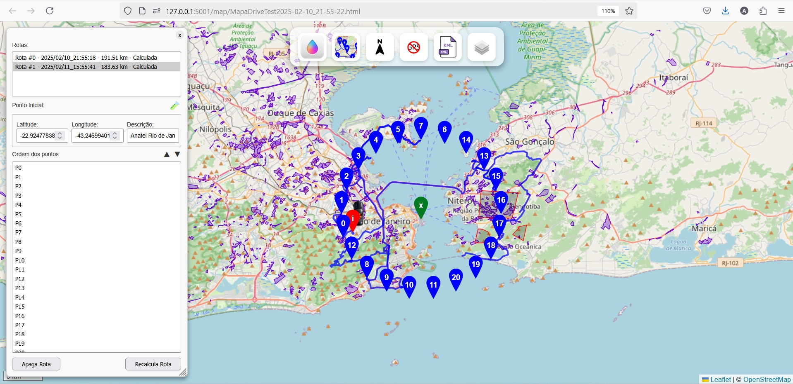
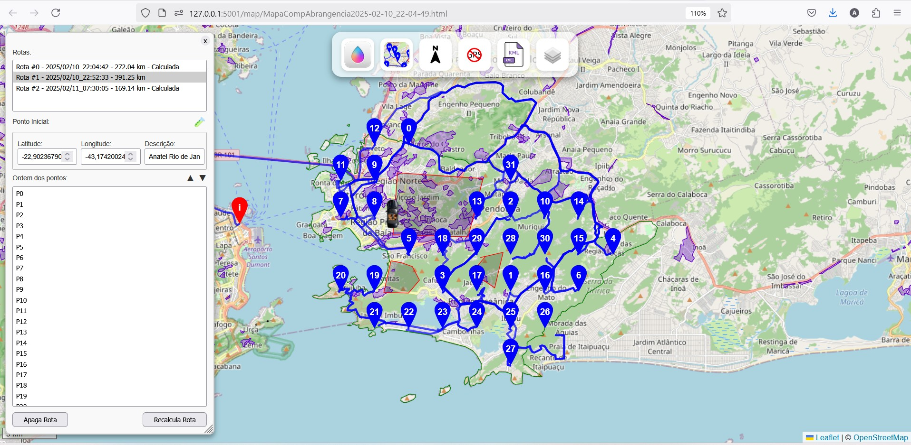

# webRotas

Vehicle route management toolkit, for inspection activities of the Brazilian Regulatory Telecommunications Agency, Anatel.

Kit de ferramentas para gerenciamento de rotas de veículos, para atividades de inspeção da Agência Nacional de Telecomunicações do Brasil, Anatel.

  
  
  

Instalação

1. Verifique se o Git está instalado

   Abra o Prompt de Comando (cmd) ou PowerShell e digite:

   git --version

   Se não estiver instalado acesse o site abaixo e o instale.

   https://git-scm.com/downloads

   Em caso de falha no uso após as instalações, recarregue os prompts para os novos paths estarem atualizados.
2. Instalar o utilitário de download wget

   Abra o Prompt de Comando (cmd) ou PowerShell e digite:

   winget install wget
3. Clonar o repositório

   No terminal (cmd, PowerShell ou Git Bash), navegue até o diretório onde deseja salvar o projeto e execute:

   git clone https://github.com/InovaFiscaliza/webRotas.git
4. Instalar o wsl

   Instalar o Windows Subsystem for Linux e reinicie o computador

   wsl.exe --install

   Em alguns sistemas, pode ser necessário habilitar o recurso de máquina virtual. Neste site, você encontrará mais detalhes sobre esse processo.

   https://learn.microsoft.com/en-us/windows/wsl/install-manual#step-3---enable-virtual-machine-feature

   Se for necessário habilitar essa opção na BIOS, o procedimento pode variar dependendo do modelo da BIOS e do tipo de CPU, seja Intel ou AMD.

   Em algumas máquinas, pode ser necessário habilitar a opção manualmente. Outra alternativa é abrir o PowerShell como administrador e executar o seguinte comando:

   dism.exe /online /enable-feature /featurename:VirtualMachinePlatform /all /norestart

   Feitas essa operações, repita a instalação do wsl

   wsl.exe --install
5. Baixar e instalar o podman desktop

   Faça o download deste url e instale

   https://podman-desktop.io/downloads/windows

   Ou execute este comando e instale

   wget https://github.com/podman-desktop/podman-desktop/releases/download/v1.16.1/podman-desktop-1.16.1-setup-x64.exe

   Se o instalador pergutar: "Note: If you would like to use docker compose up or docker-compose with Podman, enable docker
   compatibility.", habilite.

   Após isso abra o podman desktop novamente

   Dentro do podman desktop na página Dashboard e selecione "Install" para terminar a instalação do podman. Você deve ter ao
   menos 5gb de memória para o executar.
   Após instalado, o sistema deverá ser reinicializado, Volte para página Dasboard e novamente inicialize o podman.
6. Baixar e instalar o python

   wget https://repo.anaconda.com/miniconda/Miniconda3-latest-Windows-x86_64.exe

   Anote o diretório de instalação (Geralmente c:/User/SeuNomeDeUsuario)
7. Configure seu ambiente de trabalho

   Abra um Anaconda Prompt que aparecera no menu de aplicativos do Windows 11 e crie o ambiente webrotas do python

   conda env create -f https://raw.githubusercontent.com/InovaFiscaliza/webRotas/refs/heads/main/Servers/backend/webdir/environment.yaml
9. Baixar os arquivos de dados

   a - Ir para o diretório \webRotas\Servers\BR_Municipios_2022 e baixar os shapefiles dos limites municipais

   wget https://geoftp.ibge.gov.br/organizacao_do_territorio/malhas_territoriais/malhas_municipais/municipio_2022/Brasil/BR/BR_Municipios_2022.zip

   Descomprimir todo o conteudo deste arquivo neste diretório.

   b - Ir para o diretório \webRotas\Servers\Comunidades

   Abrir o site https://inde.gov.br/AreaDownload#

   Procurar os dados - Favelas e Comunidades Urbanas - 2022 IBGE - Instituto Brasileiro de Geografia e Estatística
   Baixar a opção "Shapefile" essa opção fará o download do arquivo qg_2022_670_fcu_agreg.zip, descomprimir todo seu contendo no
   diretório \webRotas\Servers\Comunidades

   c - Ir para o diretório \webRotas\Servers\Osmosis>

   Rodar os seguintes comandos para gerar um imagem estática osmosis_webrota.tar do container osmosis para funcionamento caso o docker.io saia do ar ou esse container desapareça. Atenção, redes wifi antigas em ponto de sinal fraco ocorrem erros no download dos containeres, esteja atento quando o podman run falhar mais de uma vez.

   mkdir TempData
   mkdir brazil
   podman run --name osmosis -v .:/data yagajs/osmosis osmosis
   podman commit osmosis osmosis_webrota
   podman save -o osmosis_webrota.tar osmosis_webrota

   d - Ir para o diretório \webRotas\Servers\Osmosis\brazil>

   Baixar mapa de todo o Brasil do site https://download.geofabrik.de/south-america/brazil.html usando o comando abaixo

   wget https://download.geofabrik.de/south-america/brazil-latest.osm.pbf

   e - Ir para o diretório \webRotas\Servers\OSMR\data>

   Rodar os seguintes comandos

   mkdir TempData
   podman run --name osmr -v .:/data osrm/osrm-backend
   podman commit osmr osmr_webrota
   podman save -o osmr_webrota.tar osmr_webrota

   f - Ir para o diretório \webRotas\Servers\backend\webdir

   mkdir logs
   mkdir templates
10. Testar a execução do sistema

    Clique no arquivo C:\Users\SeuNomeDeUsuario\webRotas\Servers\backend\webdir\promptwork.bat por duas vezes e abra dois prompts de trabalho.

    Verifique no Podman Desktop se o podman está executando, Olhe nas ultimas linhas do Dashboard e verifique se ele está com o status RUNNING.

    No primeiro prompt digite python Server.py para executar o servidor python.

    No segundo prompt digite python Test2.py para executar um testa de execução do sistema.

    Ao fim da execução do script Test2.py ele mostrará a resposta json do server e se for posível abrirá uma janela web com a resposta
    em html.

    Importante, durante o desenvolvimento pode ocorrer de o sistema falhar no meio de uma criação de indices, mapa ou outros eventos diversos. Para limpar todos arquivos de cache ou temporários do sistema e reiniciar seu estado, execute o script \webRotas\Servers\backend\webdir\LimpaTodosArquivosTemporarios.bat.

    No diretório \webRotas\Servers\backend\webdir\logs você encontra os logs de depuração, uma parte destes logs você vê na tela do python Server.py, mas alguns detalhes na execução dos container estão nesse log.

    Outra opção para depurar os containers é usar o Podman Desktop. Na interface, você pode visualizar a lista de containers em execução, clicar sobre um deles e acessar suas telas de saída e logs.
