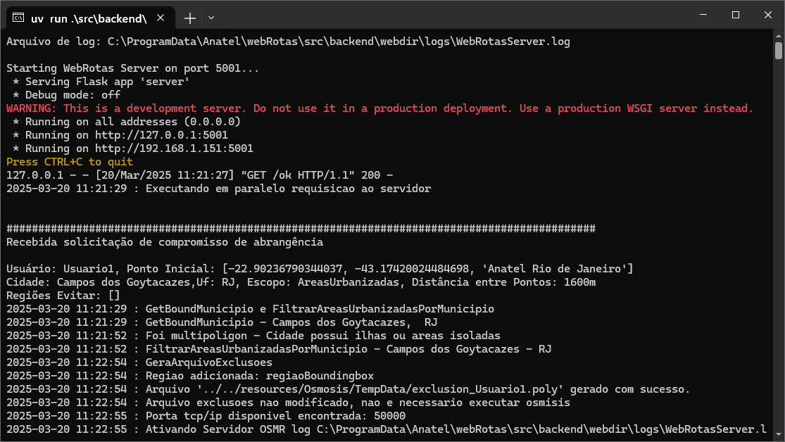

<!-- Improved compatibility of back to top link: See: https://github.com/othneildrew/Best-README-Template/pull/73 -->

<a name="indexerd-md-top"></a>

<!-- PROJECT SHIELDS -->

<!--
*** based on https://github.com/othneildrew/Best-README-Template
*** Reference links are enclosed in brackets [ ] instead of parentheses ( ).
*** See the bottom of this document for the declaration of the reference variables
*** for contributors-url, forks-url, etc. This is an optional, concise syntax you may use.
*** https://www.markdownguide.org/basic-syntax/#reference-style-links
-->

<!-- TABLE OF CONTENTS -->

<details>
  <summary>Table of Contents</summary>
  <ol>
    <li><a href="#sobre-o-webrotas">Sobre o WebRotas</a></li>
    <li><a href="#requisitos-do-sistema">Requisitos do sistema</a></li>
    <li><a href="#instalação">Instalação</a></li>
        <ul>
            <li><a href="#1-instale-o-git">Instale o Git</a></li>
            <li><a href="#2-baixe-o-webrotas">Baixe o WebRotas</a></li>
            <li><a href="#3-instale-o-wsl">Instale o WSL</a></li>
            <li><a href="#4-instale-o-podman">Instale o Podman</a></li>
            <li><a href="#5-instale-o-conda">Instale o Conda</a></li>
        </ul>
    <li><a href="#baixar-dados-de-referência">Baixar Dados de Referência</a></li>
        <ul>
            <li><a href="#1---limites-municipais-brasileiros---2023">Limites Municipais Brasileiros - 2023</a></li>
            <li><a href="#2---favelas-e-comunidades-urbanas---2022">Favelas e Comunidades Urbanas - 2022</a></li>
            <li><a href="#3---arruamento-para-cálculo-de-rotas-osm">Arruamento para cálculo de rotas OSM</a></li>
        </ul>
    <li><a href="#configuração-do-ambiente-de-trabalho">Configuração do ambiente de trabalho</a></li>
        <ul>
            <li><a href="#1--criação-do-ambiente-conda">Criação do Ambiente Conda</a></li>
            <li><a href="#2--criação-do-ambiente-podman">Criação do Ambiente Podman</a></li>
        </ul>
    <li><a href="#inicializando-o-servidor">Inicializando o Servidor</a></li>
    <li><a href="#teste-e-uso-do-webrotas">Teste e uso do WebRotas</a></li>
    <li><a href="#contribuindo">Contribuindo</a></li>
    <li><a href="#licença">Licença</a></li>
    <li><a href="#referências-adicionais">Referências adicionais</a></li>

</ol>
</details>

<!-- ABOUT -->

# Sobre o WebRotas

Kit de ferramentas para gerenciamento de rotas de veículos, para atividades de inspeção da Agência Nacional de Telecomunicações do Brasil, Anatel.

As imagens à seguir apresentam os 3 principais modos de cálculo, que são:

1. **Pontos de Visita** - Cálculo de rotas para visitas a pontos de inspeção, com a possibilidade de definir a ordem de visitação dos pontos. Por exemplo, para verificação de um conjunto de estações de rádio base. Para este modo, é necessário definir os pontos a serem visitados.

   
2. **Abrangência** - Cálculo de rotas para verificação de pontos regulares distribuídos em uma área. Para este modo, é necessário definir o polígono da área a ser inspecionada e a densidade de pontos a serem visitados em termos da distância entre estes. O sistema calcula as coordenadas dos pontos a serem visitados.

   
3. **Contorno** - Cálculo de rota para verificação de pontos regularmente distribuídos em torno de um ponto central. Pare este modo é necessário definir o ponto central, o raio e o distanciamento entre os pontos. O sistema calcula as coordenadas dos pontos a serem visitados.

   

<div align="right">
    <a href="#indexerd-md-top">
        
    </a>
</div>

<!-- System requirements -->

# Requisitos do sistema

- Windows 10 1709 (build 16299) ou posterior
- PowerShell 7.4 ou posterior
- WinGet 1.10 ou posterior
- 8GB of RAM
- 10GB de espaço livre em disco
- Conexão de internet

Vc pode verificar a versão do Windows usando o comando

```shell
winver
```

Verifique se dispõe do Winget digitando o comando:

```shell
winget --version
```

`Winget` não estará disponível até que você tenha feito login no Windows como usuário pela primeira vez, acionando o Microsoft Store para registrar o Windows Package Manager como parte de um processo assíncrono. Consulte [MS Use o WinGet tool para instalar e gerenciar aplicativos](https://learn.microsoft.com/en-us/windows/package-manager/winget/) para mais informações.

Verifique a versão PowerShell usando o comando

```shell
$PSVersionTable.PSVersion
```

PowerShell pode ser atualizado para a versão mais recente utilizando winget com o seguinte comando:

```shell
winget install Microsoft.PowerShell
```


 Para outros métodos, verifique o [procedimento de instalação do PowerShell](https://learn.microsoft.com/en-us/powershell/scripting/install/installing-powershell-on-windows?view=powershell-7.5)

<div style="margin: auto; border: 1px solid darkgray; border-radius: 10px; background-color: lightgray; padding: 10px; color: black; width: 80%; align: center;">
        <strong>⚠️ IMPORTANTE</strong> <br><br>
        Todos os comandos indicados à seguir devem ser executados no terminal do <strong>PowerShell</strong><br><br>
</div>

<div align="right">
    <a href="#indexerd-md-top">
        
    </a>
</div>

<!-- Install -->

# Instalação

## 1. Instale o **Git**

Mas antes, verifique se já não está instalado utilizando o seguinte comando no terminal do Prompt de Comando (cmd) ou PowerShell:

```shell
git --version
```

Caso negativo, instale git usando:

```shell
winget install Git.Git
```

<div align="right">
    <a href="#indexerd-md-top">
        
    </a>
</div>

## 2. Baixe o **WebRotas**

Utilize uma pasta para salvar o projeto. De preferência escolha uma pasta que atenda aos seguintes critérios:

- fácil acesso;
- não protegida por permissões de administrador;
- não sincronizadas com serviços de nuvem como OneDrive, Google Drive, etc.

Por exemplo, crie uma pasta chamada `C:\Users\<SeuNomeDeUsuario>\anatel`.

Utilizando os seguintes comandos para criar a pasta e navegar até ela:

```shell
mkdir C:\Users\<SeuNomeDeUsuario>\appdata\Local\anatel

cd C:\Users\<SeuNomeDeUsuario>\appdata\Local\anatel
```

Clone o repositório com o comando:

```shell
git clone https://github.com/InovaFiscaliza/webRotas.git
```

Após esse comando, será criada uma pasta chamada `webRotas` com todos os arquivos do projeto.

A pasta raiz escolhida para o projeto será referenciada nos passos seguintes apenas como `.\`, referindo-se à pasta `webRotas` criada no passo anterior.

<div align="right">
    <a href="#indexerd-md-top">
        
    </a>
</div>

## 3. Instale o **wsl**

Verifique se WSL está instalado utilizando o comando:

```shell
wsl.exe --version
```

Caso não esteja instalado, execute:

```shell
wsl.exe --install
```

Em alguns sistemas, pode ser necessário habilitar o recurso de máquina virtual. Neste site, você encontrará mais detalhes na [documentação do Subsistema Linux do Windows](dhttps://learn.microsoft.com/en-us/windows/wsl/install-manual#step-3---enable-virtual-machine-feature)

O procedimento pode variar dependendo do modelo da BIOS e do tipo de CPU.

Em algumas máquinas, pode ser necessário habilitar a opção manualmente. Outra alternativa é abrir o PowerShell como administrador e executar o seguinte comando:

```shell
dism.exe /online /enable-feature /featurename:VirtualMachinePlatform /all /norestart
```

Feitas essa operações, repita a instalação do wsl com o comando `wsl.exe --install`

<div align="right">
    <a href="#indexerd-md-top">
        
    </a>
</div>

## 4. Instale o **podman**

Instale o podman engine utilizando winget

```shell
winget install RedHat.Podman
```

Para facilitar o uso do podman, vc pode também instalar o podman desktop, que é uma interface gráfica para o podman engine.

```shell
winget install RedHat.PodmanDesktop
```

Utilize a opção: `docker-compose with Podman, enable docker compatibility` quando solicitado.

Após instalado, o sistema deverá ser reinicializado.

Para facilitar o uso do podman, você pode também instalar o `Podman Desktop`, que é uma interface gráfica para o `Podman Engine`. Use o comando e siga as instruções do instalador.

```shell
winget install RedHat.PodmanDesktop
```

<div align="right">
    <a href="#indexerd-md-top">
        
    </a>
</div>

## 5. Instale o **Conda**

```shell
winget install miniconda3

uv init

winget install --id=astral-sh.uv  -e
```

https://github.com/astral-sh/uv/issues/11466

Após a instalação, abra o Anaconda Prompt e execute o comando:

```shell
conda init

uv init

uv pip install https://github.com/cgohlke/geospatial-wheels/releases/download/v2025.1.20/GDAL-3.10.1-cp313-cp313-win_amd64.whl
```

Feche o terminal de comando e abra novamente.

<div align="right">
    <a href="#indexerd-md-top">
        
    </a>
</div>

# Baixar Dados de Referência

## 1 - limites municipais brasileiros - 2023

Baixe os dados de limites políticos municipais brasileiros com a seguinte sequência de comandos:

```shell
cd \src\resources\BR_Municipios

Invoke-WebRequestdi-OutFile BR_Municipios_2023.zip -Uri https://geoftp.ibge.gov.br/organizacao_do_territorio/malhas_territoriais/malhas_municipais/municipio_2023/Brasil/BR_Municipios_2023.zip

Expand-Archive -LiteralPath BR_Municipios_2023.zip -DestinationPath .\

rm BR_Municipios_2023.zip
```

<div align="right">
    <a href="#indexerd-md-top">
        
    </a>
</div>

## 2 - Favelas e Comunidades Urbanas - 2022

Baixe os dados de [favelas](https://inde.gov.br/AreaDownload#) brasileiras com a seguinte sequência de comandos:

```shell
cd .\Servers\Comunidades

Invoke-WebRequest -OutFile qg_2022_670_fcu_agreg.zip -Uri "https://geoservicos.ibge.gov.br/geoserver/CGMAT/ows?service=WFS&version=1.0.0&request=GetFeature&typeName=CGMAT:qg_2022_670_fcu_agreg&outputFormat=SHAPE-ZIP"

Expand-Archive -LiteralPath qg_2022_670_fcu_agreg.zip -DestinationPath .\

rm qg_2022_670_fcu_agreg.zip
```

<div align="right">
    <a href="#indexerd-md-top">
        
    </a>
</div>

## 3 - Arruamento para cálculo de rotas OSM

Baixe os dados de [Arruamento](https://download.geofabrik.de/south-america/brazil.html) com a seguinte sequência de comandos:

```shell
cd .\Servers\Osmosis\brazil

Invoke-WebRequest -OutFile brazil-latest.osm.pbf -Uri https://download.geofabrik.de/south-america/brazil-latest.osm.pbf

```

<div align="right">
    <a href="#indexerd-md-top">
        
    </a>
</div>

# Configuração do ambiente de trabalho

## 1- Criação do Ambiente Conda

Crie o ambiente de trabalho com o comando:

```shell
conda env create -f https://raw.githubusercontent.com/InovaFiscaliza/webRotas/refs/heads/main/Servers/backend/webdir/environment.yaml
```

Ative o ambiente de trabalho com o comando:

```shell
conda activate webRotas
```

Verifique se o caminho onde o ambiente criado usando o comando:

```shell
conda env list
```

<div align="right">
    <a href="#indexerd-md-top">
        
    </a>
</div>

## 2- Criação do Ambiente Podman

São utilizados containeres para pré-processamento dos mapas de arruamento e cálculo de rotas. Estes incluem  [**osmosis**](https://github.com/yagajs/docker-osmosis) e [**osrm-backend**](https://github.com/Project-OSRM/osrm-backend)..

Descarregue as imagens dos containeres com a seguinte sequência de comandos:

```shell
podman pull yagajs/osmosis

podman pull osrm/osrm-backend
```

<div align="right">
    <a href="#indexerd-md-top">
        
    </a>
</div>

Prepare pastas e imagem do container para o Osmosis com a seguinte sequência de comandos:

```shell
cd .\src\resources\Osmosis

podman run --name osmosis -v .:/data yagajs/osmosis osmosis

podman commit osmosis osmosis_webrota

podman save -o osmosis_webrota.tar osmosis_webrota
```

Tendo sido realizadas todas as operações, deve ser possível visualizar cópia da imagem do container `osmosis_webrota.tar` no diretório `.\Servers\Osmosis`.

Preparar pastas e imagem do container para o OSRM com a seguinte sequência de comandos:

```shell
cd .\src\resources\OSMR\data

podman run --name osmr -v .:/data osrm/osrm-backend

podman commit osmr osmr_webrota

podman save -o osmr_webrota.tar osmr_webrota
```

Tendo sido realizadas todas as operações, deve ser possível visualizar cópia da imagem do container `osmr_webrota.tar` no diretório `.\Servers\OSRM`.

Preparar pastas e arquivos para o servidor com a seguinte sequência de comandos:

```shell
cd .\Servers\backend\webdir

mkdir logs

mkdir templates
```

<div align="right">
    <a href="#indexerd-md-top">
        
    </a>
</div>

<!-- Server init -->

# Inicializando o Servidor

Abra um terminal do prompt de comando e ative o ambiente de trabalho com o comando:

```shell
conda activate webRotas
```

Execute o servidor python com o comando:

```shell
python .\Servers\backend\webdir\Server.py
```

A inicialização do servidor pode levar alguns minutos, dependendo do hardware do computador. Quando concluída a inicialização, o script indicará a situação do servidor e como acessar o serviço, conforme a imagem a seguir:



<div align="right">
    <a href="#indexerd-md-top">
        
    </a>
</div>

# Teste e uso do WebRotas

Alguns exemplos foram disponibilizados para teste e uso do WebRotas.

| Nome do Teste | Descrição |
| --- | --- |
| [visita_pontos.py](./tests/visita_pontos.py) | Calcula a rota para visitar pontos de inspeção |
| abrangencia.py | Calcula a rota para visitar pontos regularmente distribuídos em uma área |
| contorno.json | Exemplo no Rio de Janeiro de contorno de um ponto central com 3 regiões de exclusão |

Para executar um dos exemplos:

1. Inicialize o servidor conforme descrito [anteriormente](#inicializando-o-servidor).
2. Em um novo terminal, execute o comando `uv run <nome_do_teste>.py` para executar o teste desejado.
   
Por exemplo, para executar o teste `visita_pontos.py`, execute o comando:

```shell
uv run .\tests\visita_pontos.py
```

Utilize os exemplos como base para utilizar o WebRotas em suas próprias aplicações, escolhendo o exemplo mais próximo do desejado e alterando em acordo os campos na variável `payload`, detacada no início script.


A execução do teste pode levar alguns minutos, dependendo do hardware do computador.

Ao fim da execução do script de teste, será apresentado no terminal a resposta json do servidor e, caso as configurações do ambiente estejam corretas, será aberta uma janela do navegador padrão com a página html da resposta, onde será possível realizar operações como a alteração da ordem de visita dos pontos, alteração do ponto inicial, exportação da rota em formato kml, etc.

O terminal apresentará também o link para a página html, conforme a imagem a seguir:


<div style="margin: auto; border: 1px solid darkgray; border-radius: 10px; background-color: lightgray; padding: 10px; color: black; width: 80%; align: center;">
        <strong>⚠️ IMPORTANTE</strong> <br><br>
        Pode ocorrer falha no processo de criação de índices, mapa ou outros eventos.<br><br>Para limpar todos arquivos de cache ou temporários do sistema e reiniciar seu estado. Para corrigir esse erro, execute o seguinte script: <br><br> <div style="border-radius: 5px; background-color: darkgray; padding: 10px;"><i><em>\webRotas\Servers\backend\webdir\LimpaTodosArquivosTemporarios.bat.</i></em></div></td></td>
        </tr>
    </table>
</div>
<br>


No diretório `\webRotas\Servers\backend\webdir\logs` você encontra os logs de depuração, uma parte destes logs você vê na tela do python Server.py, mas alguns detalhes na execução dos container estão nesse log.

Outra opção para depurar os containers é usar o Podman Desktop. Na interface, você pode visualizar a lista de containers em execução, clicar sobre um deles e acessar suas telas de saída e logs.

<div align="right">
    <a href="#indexerd-md-top">
        
    </a>
</div>

<!-- CONTRIBUTING -->

# Contribuindo

Contribuições são o que tornam a comunidade de código aberto um lugar incrível para aprender, inspirar e criar. Qualquer contribuição que você fizer é **muito apreciada**.

Se você tiver uma sugestão que tornaria isso melhor, por favor, faça um fork do repositório e crie um pull request. Você também pode simplesmente abrir uma issue com a tag "enhancement".

<div align="right">
    <a href="#indexerd-md-top">
        
    </a>
</div>

<!-- LICENSE -->

# Licença

Distribuído sob a licença GNU General Public License (GPL), versão 3. Veja [`LICENSE.txt`](../../LICENSE).

Para informações adicionais, consulte [https://www.gnu.org/licenses/quick-guide-gplv3.html](https://www.gnu.org/licenses/quick-guide-gplv3.html)

Este modelo de licença foi selecionado com a ideia de permitir a colaboração de qualquer pessoa interessada nos projetos listados dentro deste grupo.

Está em linha com as diretrizes de Software Público Brasileiro, conforme publicado em: [https://softwarepublico.gov.br/social/articles/0004/5936/Manual_do_Ofertante_Temporario_04.10.2016.pdf](https://softwarepublico.gov.br/social/articles/0004/5936/Manual_do_Ofertante_Temporario_04.10.2016.pdf)

Material adicional pode ser encontrado em:

- [http://copyfree.org/policy/copyleft](http://copyfree.org/policy/copyleft)
- [https://opensource.stackexchange.com/questions/9805/can-i-license-my-project-with-an-open-source-license-but-disallow-commercial-use](https://opensource.stackexchange.com/questions/9805/can-i-license-my-project-with-an-open-source-license-but-disallow-commercial-use)
- [https://opensource.stackexchange.com/questions/21/whats-the-difference-between-permissive-and-copyleft-licenses/42#42](https://opensource.stackexchange.com/questions/21/whats-the-difference-between-permissive-and-copyleft-licenses/42#42)

<div align="right">
    <a href="#indexerd-md-top">
        
    </a>
</div>

<!-- REFERENCES -->

## Referências adicionais

- [Conda Cheat Sheet](https://docs.conda.io/projects/conda/en/4.6.0/_downloads/52a95608c49671267e40c689e0bc00ca/conda-cheatsheet.pdf)
- [Podman Cheat Sheet](https://people.redhat.com/tmichett/do180/podman_basics.pdf)

<div align="right">
    <a href="#indexerd-md-top">
        
    </a>
</div>
