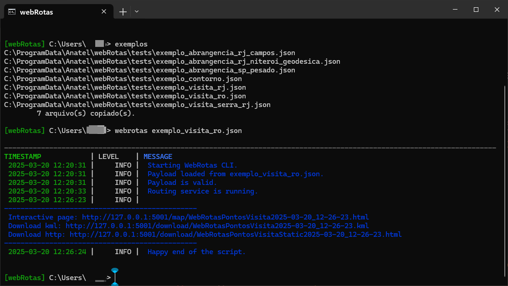

<!-- Improved compatibility of back to top link: See: https://github.com/othneildrew/Best-README-Template/pull/73 -->

<a name="indexerd-md-top"></a>

<!-- PROJECT SHIELDS -->

<!--
*** based on https://github.com/othneildrew/Best-README-Template
*** Reference links are enclosed in brackets [ ] instead of parentheses ( ).
*** See the bottom of this document for the declaration of the reference variables
*** for contributors-url, forks-url, etc. This is an optional, concise syntax you may use.
*** https://www.markdownguide.org/basic-syntax/#reference-style-links
-->

<!-- TABLE OF CONTENTS -->

<details>
  <summary>Table of Contents</summary>
  <ol>
    <li><a href="#sobre-o-webrotas">Sobre o WebRotas</a></li>
    <li><a href="#requisitos-do-sistema">Requisitos do sistema</a></li>
    <li><a href="#instalação">Instalação</a></li>
        <ul>
            <li><a href="#1-instale-o-git">Instale o Git</a></li>
            <li><a href="#2-baixe-o-webrotas">Baixe o WebRotas</a></li>
            <li><a href="#3-instale-o-wsl">Instale o WSL</a></li>
            <li><a href="#4-instale-o-podman">Instale o Podman</a></li>
            <li><a href="#5-instale-o-uv">Instale o UV</a></li>
        </ul>
    <li><a href="#baixar-dados-de-referência">Baixar Dados de Referência</a></li>
        <ul>
            <li><a href="#1---limites-municipais-brasileiros---2023">Limites Municipais Brasileiros - 2023</a></li>
            <li><a href="#2---favelas-e-comunidades-urbanas---2022">Favelas e Comunidades Urbanas - 2022</a></li>
            <li><a href="#3---áreas-urbanizadas-do-brasil---2019">Áreas Urbanizadas do Brasil - 2019</a></li>
            <li><a href="#4---arruamento-para-cálculo-de-rotas-osm">Arruamento para cálculo de rotas OSM</a></li>
        </ul>
    <li><a href="#configuração-do-ambiente-de-trabalho">Configuração do ambiente de trabalho</a></li>
        <ul>
            <li><a href="#1--criação-do-ambiente-conda">Criação do Ambiente Conda</a></li>
            <li><a href="#2--criação-do-ambiente-podman">Criação do Ambiente Podman</a></li>
        </ul>
    <li><a href="#inicializando-o-servidor">Inicializando o Servidor</a></li>
    <li><a href="#teste-e-uso-do-webrotas">Teste e uso do WebRotas</a></li>
    <li><a href="#contribuindo">Contribuindo</a></li>
    <li><a href="#licença">Licença</a></li>
    <li><a href="#referências-adicionais">Referências adicionais</a></li>

</ol>
</details>

<!-- ABOUT -->

# Sobre o WebRotas

Kit de ferramentas para gerenciamento de rotas de veículos, para atividades de inspeção da Agência Nacional de Telecomunicações do Brasil, Anatel.

As imagens à seguir apresentam os 3 principais modos de cálculo, que são:

1. **Pontos de Visita** - Cálculo de rotas para visitas a pontos de inspeção, com a possibilidade de definir a ordem de visitação dos pontos. Por exemplo, para verificação de um conjunto de estações de rádio base. Para este modo, é necessário definir os pontos a serem visitados.

   
2. **Abrangência** - Cálculo de rotas para verificação de pontos regulares distribuídos em uma área. Para este modo, é necessário definir o polígono da área a ser inspecionada e a densidade de pontos a serem visitados em termos da distância entre estes. O sistema calcula as coordenadas dos pontos a serem visitados.

   
3. **Contorno** - Cálculo de rota para verificação de pontos regularmente distribuídos em torno de um ponto central. Pare este modo é necessário definir o ponto central, o raio e o distanciamento entre os pontos. O sistema calcula as coordenadas dos pontos a serem visitados.

   

<div align="right">
    <a href="#indexerd-md-top">
        
    </a>
</div>

<!-- System requirements -->

# Requisitos do sistema

- Windows 10 1709 (build 16299) ou posterior
- PowerShell 7.4 ou posterior
- WinGet 1.10 ou posterior
- Recursos de virtualização habilitados (veja [documentação do Subsistema Linux do Windows](https://learn.microsoft.com/en-us/windows/wsl/install-manual#step-3---enable-virtual-machine-feature))
- 16GB of RAM
- 10GB de espaço livre em disco
- Conexão de internet

Devido à necessidade de uso de recurso de virtualização, esta solução usualmente não será compatível com máquinas virtuais, a menos que estas tenham sido excepcionalmente configuradas para permitir o uso de virtualização.

Vc pode verificar a versão do Windows usando o comando

```shell
winver
```

<div align="right">
    <a href="#indexerd-md-top">
        
    </a>
</div>

# Instalação

Para utilizar o webRotas, siga os passos descritos na página de [instalação](./install/README.md).

A referida página descreve passos para instalação tanto por usuários finais quanto por desenvolvedores.

# Inicializando o Servidor

A forma mais prática de usar o webRotas
Abra um terminal do prompt de comando na pasta raiz do projeto WebRotas.

Para iniciar o servidor utilize o comando: 
```shell
uv run .\src\backend\webdir\Server.py
```

A inicialização do servidor pode levar alguns minutos, dependendo do hardware do computador. Quando concluída a inicialização, o script indicará a situação do servidor e como acessar o serviço, conforme a imagem a seguir:


O serviço pode ser acessado para enviar diretamente requisições de roteamento.

Outra alternativa é diretamente para realizar cálculo de rotas à partir das definições de um arquivo json utilizando a aplicação CLI de interface cliente para o servidor. Para isso utilize o comando:

```shell
uv run .\src\ucli\webrota_client.py .\tests\exemplo_visita_ro.json
```

Caso o aplicativo cliente seja chamado sem o argumento de nome do arquivo a ser enviado ao servidor, será apresentada a ajuda com as opções disponíveis e executado exemplo de demonstração conforme indicado na seguinte figura:



<div align="right">
    <a href="#indexerd-md-top">
        
    </a>
</div>


# Teste e uso do WebRotas

Alguns exemplos foram disponibilizados para teste do WebRotas e poderão ser modificados para atender a necessidades específicas.

| Nome do Teste | Descrição |
| --- | --- |
| [exemplo_abrangencia_rj_campos.json](./tests/exemplo_abrangencia_rj_campos.json) | Teste de abrangência na cidade de em Campos dos Goytacazes sem de exclusão |
| [exemplo_abrangencia_rj_niteroi_geodesica.json](./tests/exemplo_abrangencia_rj_niteroi_geodesica.json) | Teste de abrangência na cidade de Niterói com 3 regiões de exclusão e algoritmo de ordenação por distância geodésica |
| [exemplo_abrangencia_sp_pesado.json](./tests/exemplo_abrangencia_sp_pesado.json) | Teste de abrangência pesado, na cidade de São Paulo, sem regiões de exclusão |
| [exemplo_contorno.json](./tests/exemplo_contorno.json) | Teste de pontos de visita na cidade do Rio de Janeiro com 3 regiões de exclusão e algoritmo de ordenação por distância geodésica |
| [exemplo_visita_rj.json](./tests/exemplo_visita_rj.json) | Teste de pontos de visita na cidade do Rio de Janeiro com 3 regiões de exclusão e algoritmo de ordenação por distância geodésica |
| [exemplo_visita_ro.json](./tests/exemplo_visita_ro.json) | Teste de pontos de visita na cidade de Boa Vista com 2 regiões de exclusão e algoritmo de ordenação por distância geodésica |
| [exemplo_visita_serra_rj.json](./tests/exemplo_visita_serra_rj.json) | Teste de pontos de visita na Serra do Rio de Janeiro, sem regiões de exclusão e algoritmo de ordenação por distância OSMR MultiThread |

Para executar um dos exemplos execute o comando:

```shell
uv run .\src\ucli\webrota_client.py .\tests\<nome_do_teste>.json
```

A execução do teste pode levar alguns minutos, dependendo do hardware do computador, acompanhe as mensagens no terminal onde é executado o script, assim como no terminal adicional que é aberto para o servidor.

Ao fim da execução do script de teste, será apresentado no terminal a resposta json do servidor e, caso as configurações do ambiente estejam corretas, será aberta uma janela do navegador padrão com a página html da resposta, onde será possível realizar operações como a alteração da ordem de visita dos pontos, alteração do ponto inicial, exportação da rota em formato kml, etc.

O terminal apresentará também o link para a página html, conforme a imagem a seguir:


<div style="margin: auto; border: 1px solid darkgray; border-radius: 10px; background-color: lightgray; padding: 10px; color: black; width: 80%; align: center;">
        <strong>⚠️ IMPORTANTE</strong> <br><br>
        Pode ocorrer falha no processo de criação de índices, mapa ou outros eventos.<br><br>Para limpar todos arquivos de cache ou temporários do sistema e reiniciar seu estado. Para corrigir esse erro, execute o seguinte script: <br><br> <div style="border-radius: 5px; background-color: darkgray; padding: 10px;"><i><em>\webRotas\Servers\backend\webdir\LimpaTodosArquivosTemporarios.bat.</i></em></div></td></td>
        </tr>
    </table>
</div>
<br>

No diretório `\webRotas\Servers\backend\webdir\logs` você encontra os logs de depuração, uma parte destes logs você vê na tela do python Server.py, mas alguns detalhes na execução dos container estão nesse log.

Outra opção para depurar os containers é usar o Podman Desktop. Na interface, você pode visualizar a lista de containers em execução, clicar sobre um deles e acessar suas telas de saída e logs.

<div align="right">
    <a href="#indexerd-md-top">
        
    </a>
</div>

<!-- CONTRIBUTING -->

# Contribuindo

Contribuições são o que tornam a comunidade de código aberto um lugar incrível para aprender, inspirar e criar. Qualquer contribuição que você fizer é **muito apreciada**.

Se você tiver uma sugestão que tornaria isso melhor, por favor, faça um fork do repositório e crie um pull request. Você também pode simplesmente abrir uma issue com a tag "enhancement".

<div align="right">
    <a href="#indexerd-md-top">
        
    </a>
</div>

<!-- LICENSE -->

# Licença

Distribuído sob a licença GNU General Public License (GPL), versão 3. Veja [`LICENSE.txt`](../../LICENSE).

Para informações adicionais, consulte [https://www.gnu.org/licenses/quick-guide-gplv3.html](https://www.gnu.org/licenses/quick-guide-gplv3.html)

Este modelo de licença foi selecionado com a ideia de permitir a colaboração de qualquer pessoa interessada nos projetos listados dentro deste grupo.

Está em linha com as diretrizes de Software Público Brasileiro, conforme publicado em: [https://softwarepublico.gov.br/social/articles/0004/5936/Manual_do_Ofertante_Temporario_04.10.2016.pdf](https://softwarepublico.gov.br/social/articles/0004/5936/Manual_do_Ofertante_Temporario_04.10.2016.pdf)

Material adicional pode ser encontrado em:

- [http://copyfree.org/policy/copyleft](http://copyfree.org/policy/copyleft)
- [https://opensource.stackexchange.com/questions/9805/can-i-license-my-project-with-an-open-source-license-but-disallow-commercial-use](https://opensource.stackexchange.com/questions/9805/can-i-license-my-project-with-an-open-source-license-but-disallow-commercial-use)
- [https://opensource.stackexchange.com/questions/21/whats-the-difference-between-permissive-and-copyleft-licenses/42#42](https://opensource.stackexchange.com/questions/21/whats-the-difference-between-permissive-and-copyleft-licenses/42#42)

<div align="right">
    <a href="#indexerd-md-top">
        
    </a>
</div>

<!-- REFERENCES -->

## Referências adicionais

- [UV Short Guide](https://www.saaspegasus.com/guides/uv-deep-dive/)
- [Podman Cheat Sheet](https://people.redhat.com/tmichett/do180/podman_basics.pdf)

<div align="right">
    <a href="#indexerd-md-top">
        
    </a>
</div>
